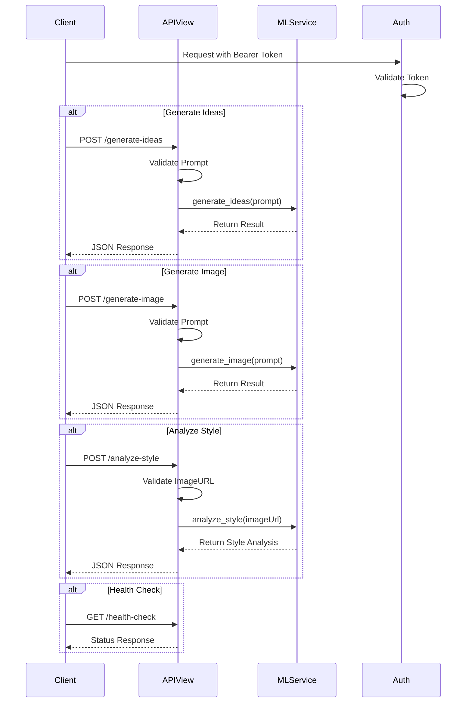
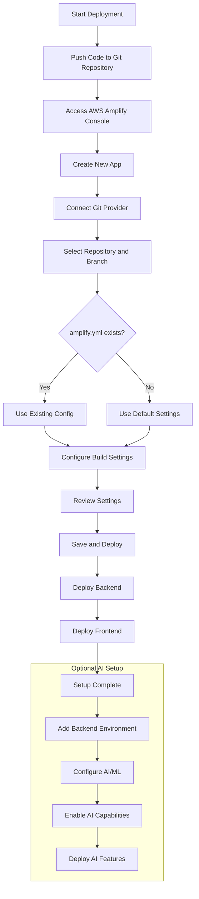

I'll create a sequence diagram showing the flow of the ML API services and a flowchart for the AWS Amplify deployment process based on the code provided.

First, let's show the ML API flow:

Now, let's show the AWS Amplify deployment flow:

These diagrams show:
1. The sequence diagram illustrates the interaction between the client, API views, and ML service, including authentication flow and different endpoint behaviors.
2. The flowchart shows the step-by-step process of deploying to AWS Amplify, including the optional AI setup process.

[//]: # (This content was generated by AppMap Navie.)
[//]: # (messageId: 56b4ac8b-dd35-4af4-a843-346d900efe10)
[//]: # (threadId: e9200397-98bf-4b46-ac09-d4c1a0faf26d)
